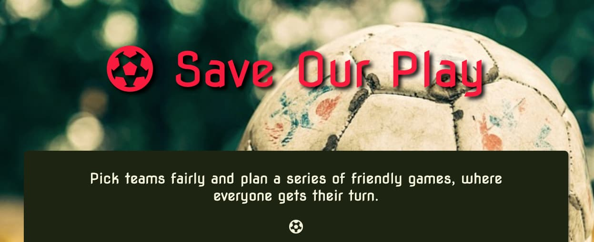
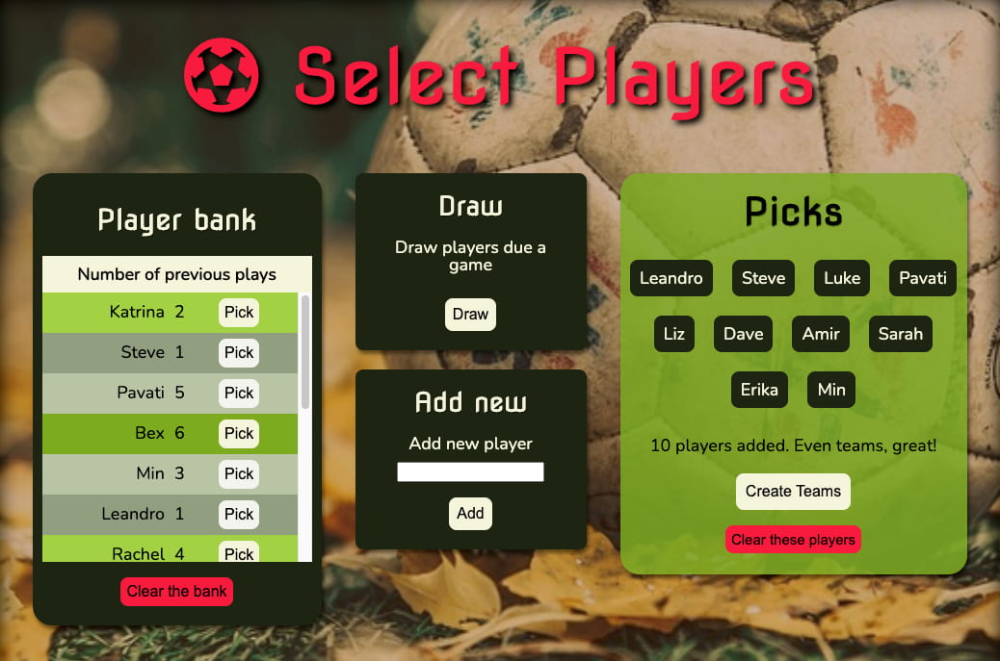
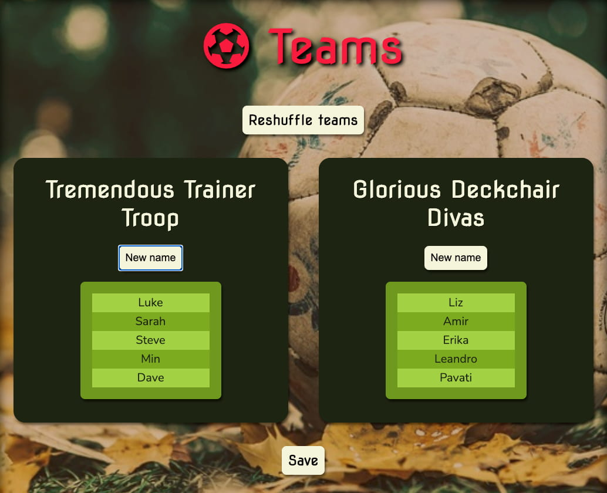

# Save Our Play

Save our Play is a React-Redux web application built in accordance with a [brief](https://3.basecamp.com/4525821/buckets/18134884/documents/2886516324) to create a tool which randomly picks football teams, for the individual technical challenge set at the end of the DevelopMe Fellowship. The app is available [here](https://ammersive.github.io/team-picker/). This is the repository for Version 1, in which player information is stored locally for each browser session. [Version 2](https://ammersive.github.io/save-our-play/) supports storage of player information between sessions, powered by [this API](https://github.com/ammersive/tp-back). 

## Pick teams fairly and plan a series of friendly games, where everyone gets their turn.

### Save Our Play is a web application for groups who play a regular series of games, considering:

- Not everyone is available to play in each game.
- More people may want to play than the team size - particularly with current COVID restrictions on the numbers in which teams can safely meet and practice.

## Features

### Player bank

To help adjudicate who’s due the next game when there are more people who want to play than spaces available, the player bank keeps track of the games assigned to each player on save. You can pick available players directly from the bank when you plan games. New players added in the Select Players screen will appear in the bank after pressing the Create Teams button and then pressing Save in the Teams screen.

### Draw by play-count

The Draw feature automatically picks players from the bank with the lowest play-counts. If multiple players share the lowest count, the selection is randomised within this set.

### n-aside support

Any team size is supported, respecting variation in restrictions. A warning displays when teams will have an uneven number of players.

### Randomise Teams

Once happy with player selection, sort players into teams randomly with Create Teams, moving to the Teams screen. Once on the Teams screen, you can randomise the arrangements again with Reshuffle teams.

### Team name generator

Don’t take play too seriously? The Generate team namefeature will give you a (near) endless supply of tongue-in-cheek triple-barrel names for each side.

# Run a local version of the Save Our Play UI:

From the terminal:

1. Navigate to the desired location for project in the file system.
2. Run: `git clone {git@github.com:ammersive/team-picker.git} {your-chosen-foldername}`
3. Install the required packages by running: `npm install`
4. To view local version in the browser, run: `npm start`

# Create React App Documentation

This project was bootstrapped with [Create React App](https://github.com/facebook/create-react-app).

## Available Scripts

In the project directory, you can run:

### `npm start`

Runs the app in the development mode.\
Open [http://localhost:3000](http://localhost:3000) to view it in the browser.

The page will reload if you make edits.\
You will also see any lint errors in the console.

### `npm test`

Launches the test runner in the interactive watch mode.\
See the section about [running tests](https://facebook.github.io/create-react-app/docs/running-tests) for more information.

### `npm run build`

Builds the app for production to the `build` folder.\
It correctly bundles React in production mode and optimizes the build for the best performance.

The build is minified and the filenames include the hashes.\
Your app is ready to be deployed!

See the section about [deployment](https://facebook.github.io/create-react-app/docs/deployment) for more information.

### `npm run eject`

**Note: this is a one-way operation. Once you `eject`, you can’t go back!**

If you aren’t satisfied with the build tool and configuration choices, you can `eject` at any time. This command will remove the single build dependency from your project.

Instead, it will copy all the configuration files and the transitive dependencies (webpack, Babel, ESLint, etc) right into your project so you have full control over them. All of the commands except `eject` will still work, but they will point to the copied scripts so you can tweak them. At this point you’re on your own.

You don’t have to ever use `eject`. The curated feature set is suitable for small and middle deployments, and you shouldn’t feel obligated to use this feature. However we understand that this tool wouldn’t be useful if you couldn’t customize it when you are ready for it.

## Learn More

You can learn more in the [Create React App documentation](https://facebook.github.io/create-react-app/docs/getting-started).

To learn React, check out the [React documentation](https://reactjs.org/).

### Code Splitting

This section has moved here: [https://facebook.github.io/create-react-app/docs/code-splitting](https://facebook.github.io/create-react-app/docs/code-splitting)

### Analyzing the Bundle Size

This section has moved here: [https://facebook.github.io/create-react-app/docs/analyzing-the-bundle-size](https://facebook.github.io/create-react-app/docs/analyzing-the-bundle-size)

### Making a Progressive Web App

This section has moved here: [https://facebook.github.io/create-react-app/docs/making-a-progressive-web-app](https://facebook.github.io/create-react-app/docs/making-a-progressive-web-app)

### Advanced Configuration

This section has moved here: [https://facebook.github.io/create-react-app/docs/advanced-configuration](https://facebook.github.io/create-react-app/docs/advanced-configuration)

### Deployment

This section has moved here: [https://facebook.github.io/create-react-app/docs/deployment](https://facebook.github.io/create-react-app/docs/deployment)

### `npm run build` fails to minify

This section has moved here: [https://facebook.github.io/create-react-app/docs/troubleshooting#npm-run-build-fails-to-minify](https://facebook.github.io/create-react-app/docs/troubleshooting#npm-run-build-fails-to-minify)
